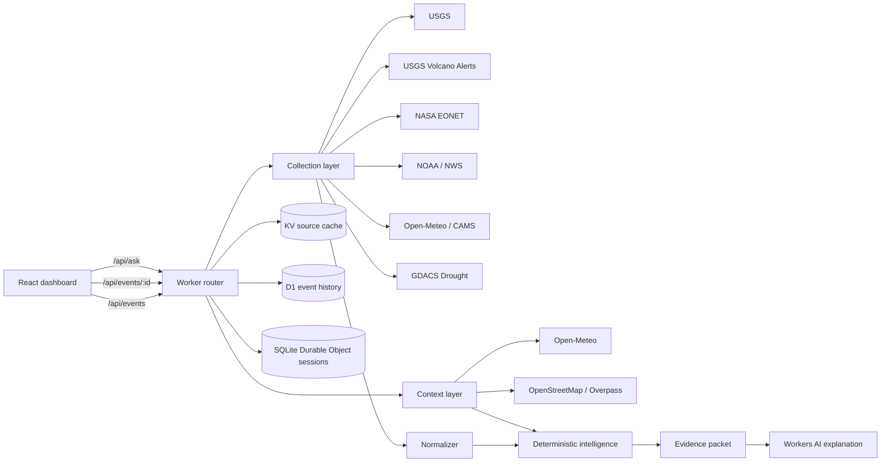

# Terra Pulse Architecture

## System shape

Terra Pulse uses npm workspaces but deploys as one Cloudflare Worker. Static
assets are served directly from the Worker asset binding; only `/api/*` invokes
application code.

## Workspace responsibilities

- `packages/earth-domain` owns shared contracts, risk thresholds, geographic
  calculations, population reference context, evidence construction, timelines,
  and graph construction. It has no Cloudflare or React dependency.
- `apps/worker` owns public-source adapters, caching, persistence, context
  enrichment, routing, scheduled collection, Workers AI, and Durable Object
  sessions.
- `apps/web` owns the responsive dashboard, GPU-rendered 3D globe, event
  exploration, selected-event intelligence, and accessible interaction states.

## Runtime flow

1. `/api/events` checks source-specific KV entries, fetches six expired feeds
   in parallel, normalizes them, calculates priority, and returns a
   source-status envelope. The default bounded map packet reserves capacity for
   every available event family before filling remaining slots by priority.
2. `/api/events/:id` adds point weather, air quality, nearby reference cities,
   mapped hospitals, D1 history, evidence labels, and graph relationships.
3. `/api/ask` creates a deterministic answer first. A per-session Durable Object
   gives Workers AI only the structured packet and recent bounded history. If AI
   fails or reaches a platform limit, the deterministic answer is returned.
4. The 15-minute cron refreshes feeds and persists bounded event snapshots and
   history. Normal page/API requests do not perform D1 writes.

## Resilience

- Each upstream source fails independently.
- Invalid geometry never reaches the globe.
- All-live-source failure produces explicitly labeled demonstration records,
  never silently simulated live data.
- Context providers are optional: missing weather, air, or infrastructure is
  displayed as unknown.
- Payload sizes, timeouts, query lengths, history size, event counts, and AI
  output length are bounded.
