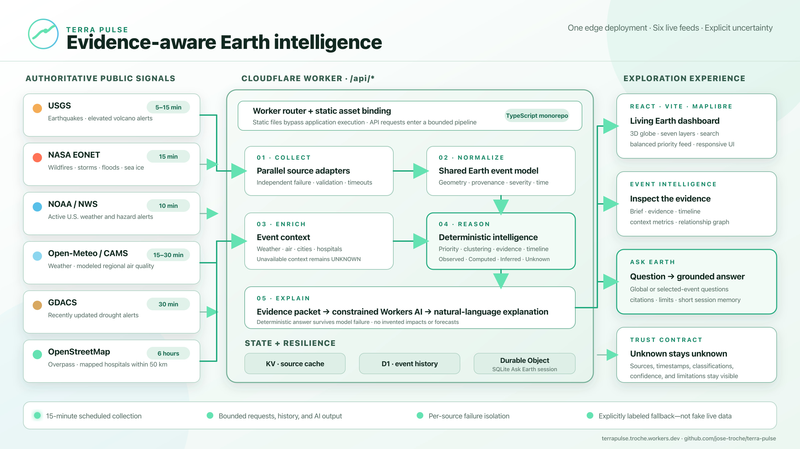

# Terra Pulse: Turning Earth’s Signals into Evidence-Aware Intelligence

Every minute, Earth generates signals: an earthquake is reviewed, a storm warning is issued, a volcano’s alert level changes, air quality deteriorates, or a drought expands. The problem is not a lack of data. The problem is fragmentation.

The observations live across different agencies, formats, update cycles, and geographic scopes. A map can plot them, but a map alone cannot explain what they mean, how they relate, or what remains unknown.

That is why **Terra Pulse** was created: a living Earth intelligence dashboard that connects authoritative public data, converts it into a common event model, adds transparent context, and explains why a signal may deserve attention.

Explore it live: https://terrapulse.troche.workers.dev

Source code: https://github.com/jose-troche/terra-pulse

## From scattered feeds to one operational picture

Terra Pulse opens on an interactive 3D globe with layers for earthquakes, wildfires, storm systems, floods, volcanoes, air quality, and climate anomalies. A priority feed highlights the most important current signals without allowing high-volume categories to hide smaller ones.

Select an event and the dashboard moves beyond the marker. It builds a brief around three questions:

- What happened?
- Why does it matter?
- What could happen next?

The same panel exposes the underlying evidence, an evolving timeline, nearby context, and a relationship graph. “Ask Earth” supports natural-language questions about the global picture or a selected event. Questions about elevated regional risk use deterministic geographic clustering first; AI explains the calculation instead of inventing the ranking.

## Six connected feeds—and honest freshness

Terra Pulse currently collects from six live feeds:

- **USGS Earthquake Hazards Program** for magnitude, depth, time, location, and tsunami indicators.
- **USGS Volcano Hazards Program** for elevated aviation color codes and alert levels.
- **NASA EONET** for open natural events such as wildfires, severe storms, floods, and sea or lake ice.
- **NOAA/National Weather Service** for active United States weather and hazard alerts.
- **Open-Meteo with Copernicus CAMS** for modeled air quality at a bounded set of major global cities.
- **GDACS** for recently updated drought alerts and approximate affected-region centroids.

Freshness is source-specific rather than hidden behind a vague “real-time” label. Earthquakes are cached for five minutes, NWS alerts for ten, EONET and elevated-volcano alerts for fifteen, and air-quality and drought data for thirty. A scheduled job runs every fifteen minutes to persist bounded event snapshots and history. Selected-event weather is refreshed on a fifteen-minute cache; air quality uses thirty minutes.

Those intervals describe Terra Pulse’s retrieval behavior, not a guarantee that the upstream observation is new. USGS earthquake records often arrive within minutes, while EONET categories may lag by minutes or hours. GDACS droughts evolve much more slowly, so Terra Pulse keeps only records updated within the previous 21 days. Every event retains its source and observation time so users can judge freshness for themselves.

Coverage is equally explicit: NWS is limited to the United States and some territories, USGS elevated-volcano alerts are not a global eruption census, and CAMS air-quality events sample selected cities rather than ground monitors everywhere.

## A methodology designed around restraint

The most important design decision is not the globe or the model. It is the evidence boundary.

Terra Pulse labels information as:

- **Observed:** published by an identified source.
- **Computed:** produced by a reproducible calculation.
- **Inferred:** a cautious monitoring implication derived from structured signals.
- **Unknown:** unsupported by the connected evidence.

This prevents a common failure in data-and-AI products: presenting a plausible sentence as a verified fact.

The 0–100 risk score is a monitoring-priority queue, not a forecast. Earthquake priority combines magnitude, depth, and a source tsunami indicator. Other event families use documented baselines and agency severity language. The stable bands are critical (82–100), high (62–81), moderate (36–61), and low (0–35). They help order attention, but they do not predict casualties, damage, or probability.

Population context is proximity to checked-in reference cities, not a claim about exposed population. Hospital context counts OpenStreetMap features tagged as hospitals within 50 kilometers, but does not establish completeness, capacity, road access, or operational status. When evidence is missing, Terra Pulse says “unknown.”

## AI explains; deterministic systems decide

AI is deliberately downstream.

Deterministic code first normalizes the event, calculates priority, builds evidence, creates the timeline and relationships, and produces a usable answer. Only then does Workers AI receive a bounded evidence packet, the question, and short session history.

The prompt prohibits invented casualties, damage, exposure, infrastructure conditions, and forecasts. If the model fails or reaches a platform limit, the deterministic answer remains available. AI adds clarity and natural language; it is not the system of record.

This pattern matters well beyond environmental intelligence: establish facts and calculations in code, constrain the model to that envelope, and preserve a non-AI fallback.

## One deployment, clearly separated responsibilities

Terra Pulse is a TypeScript monorepo with three boundaries:

- `apps/web`: React, Vite, MapLibre, responsive exploration, and accessible controls.
- `apps/worker`: APIs, collectors, enrichment, persistence, scheduled work, sessions, and AI.
- `packages/earth-domain`: shared contracts, risk rules, geospatial calculations, evidence, timelines, and graph construction.

It deploys as one Cloudflare Worker. Static assets bypass application execution, while `/api/*` enters the Worker router. Collectors run independently and cache results in KV. D1 stores bounded event history. A SQLite-backed Durable Object maintains each Ask Earth session. Upstream failure is isolated by source; if every live feed fails, the interface shows explicitly labeled demonstration records rather than silently simulated “live” data.

## What Terra Pulse is really exploring

Terra Pulse is not claiming to be a complete global hazard system. Coverage varies, model guidance is not a ground monitor, alert centroids are not affected-area boundaries, and planned integrations such as FIRMS, ReliefWeb, WorldPop, and detailed road networks are not presented as live.

The larger idea is more important: public data becomes more useful when provenance, computation, uncertainty, and explanation travel together.

The next generation of dashboards should not merely show us more. They should help us understand what is known, why it matters, and where responsible interpretation must stop.
